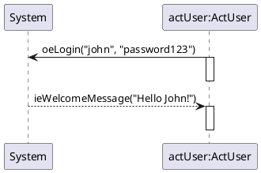

# MUCIM DSL — Messir Use-Case Instance Domain-Specific Language

## 1. Scope and Audience (Informative)

### 1.1 Background
Messir is a model-driven methodology and family of domain-specific modeling languages (DSMLs) covering requirements, analysis, design, test, and validation phases. It builds on UML and OCL to provide precise, verifiable specifications of reactive systems. Messir emphasizes scenario-driven modeling (actors, system, events, constraints) and traceability from requirements to validation artifacts. Within this family, the MUCIM DSL captures single use-case instances as constrained UML Sequence Diagrams, enforcing a system-centered interaction discipline (Actor↔System only) and well-formedness rules suitable for automated validation and documentation.

### 1.2 Purpose
Define the MUCIM (Messir Use-Case Instance Model) DSL as a constrained subset of UML Sequence Diagrams for modeling system–actor interactions in reactive system scenarios.

### 1.3 Audience
MUCIM modelers, business stakeholders, model validators, requirements engineers, and tool builders.

### 1.4 In-Scope
- Constrained UML Sequence Diagrams for single use-case instances
- Actor↔System interactions only
- Deterministic, tool-checkable rules for validation and documentation

### 1.5 Non-Goals / Out-of-Scope
- General-purpose sequence diagram modeling
- Performance or scalability modeling
- Multi-system interactions
- Asynchronous or parallel execution modeling

### 1.6 Assumptions
- Single reactive system with external actors
- Linear temporal ordering of interactions
- PlantUML is the primary concrete syntax

### 1.7 Terminology and Notation Conventions
Terminology aligns with UML and Messir. See the Glossary for definitions and abbreviations.

### 1.8 MDE Level Note (M2 vs M1)
This document separates metamodel-level constraints (M2, Abstract Syntax and Static Semantics) from model-level constraints (M1, Concrete Syntax and Naming/Style). Normative AS/SS rules belong to M2. Normative CS/NAM rules belong to M1. Examples and glossary are informative.

## 2. Normative Overview

### 2.1 DSL Identity
- Base language: UML Sequence Diagram
- Extension mechanism: UML subsetting with well-formedness constraints
- Rationale: Maximize tool interoperability while enforcing domain-specific constraints

### 2.2 Conformance Levels
- L1 Abstract Syntax: ASx compliance (model structure)
- L2 Static Semantics: SSx compliance (well-formedness)
- L3 Concrete Syntax: TCSx/GCSx compliance (PlantUML rendering)
- L4 Style: NAMx compliance (advisory)

### 2.3 Validation Severity
- Error: Model rejected (AS/SS violations)
- Warning: Style issues (NAM violations)
- Info: Optimization suggestions

### 2.4 Rule Identifier Scheme and Stability
Rule IDs are stable and unique: ASn and SSn (M2), TCSn and GCSn and NAMn (M1). Every validation message MUST reference the specific rule ID (e.g., AS1, SS2, TCS5, GCS2, NAM3).

## 3. Metamodel Level (M2) — Abstract Syntax and Static Semantics (Normative)

### 3.1 Abstract Syntax (AS)

#### 3.1.1 Element Inventory
- `Interaction`: Root container for the MUCIM model
- `Lifeline`: System and Actor participants
- `Message`: Actor↔System communications only
- `OccurrenceSpecification`: Message send/receive events
- `ExecutionSpecification`: Actor activation intervals

#### 3.1.2 Forbidden UML Concepts
- `CombinedFragment`: No combined fragments
- `InteractionOperand`: No interaction operands
- `Constraint`: No constraint
- `InteractionUse`: No interaction references
- `StateInvariant`: No state constraints
- `Gate`: No interface gates
- `GeneralOrdering`: Temporal order is textual order
- `DestructionOccurrenceSpecification`: No object destruction
- `CreationEvent`: No object creation during interaction

#### 3.1.3 Mapping to UML Metamodel
- Scenario (SCE) → UML Interaction: exactly one per model, root container
- System (SYS) → UML Lifeline: exactly one, named "System"
- Actor (ACT) → UML Lifeline: not "System"; type matches `Act[A-Z][A-Za-z0-9]*`
- Output Event (OE) → UML Message: sender Actor, receiver System
- Input Event (IE) → UML Message: sender System, receiver Actor
- Activation Bar (AB) → UML ExecutionSpecification: only on Actors; no nesting/overlap; none on System
- Event Parameter (EP) → UML ValueSpecification(s): ordered arguments on Messages

#### 3.1.4 Abstract Syntax Rules (AS)

**AS — System (SYS)**

AS1_SYS_UNIQUE.
There must be exactly one System per model that is always named System

AS2_SYS_DECLARED_FIRST.
The System must be declared first before all actors.

AS3_SYS_ACT_ALLOWED_EVENTS.
Events must always be from System (resp. Actor) to an Actor (resp. the System). System → Actor or Actor → System
Canonical semantics for message directionality is specified in SS1_MESSAGE_DIRECTIONALITY.

AS4_SYS_NO_SELF_LOOP.
Events must never be from System to System. System → System
Canonical semantics for message directionality is specified in SS1_OEIE_MESSAGE_DIRECTIONALITY.

**AS — Actors (ACT)**

AS5_ACT_DECLARED_AFTER_SYS.
The actors must be declared after the System.

AS6_ACT_NO_ACT_ACT_EVENTS.
Events must never be from Actor to Actor. Actor → Actor
Canonical semantics for message directionality is specified in SS1_OEIE_MESSAGE_DIRECTIONALITY.

AS7_ACT_TYPE_FORMAT.
Actor type name must be human-readable, in FirstCapitalLetterFormat and prefixed by "Act"
Example 1 : ActMsrCreator
Example 2 : ActEcologist

**AS — Input Events (IE)**

AS8_IE_EVENT_DIRECTION.
System sends event TO actor (System → Actor) — Input Event FROM System TO actor
Note. The "ie" prefix refers to the actor's perspective, not the system's perspective
Canonical semantics for message directionality is specified in SS1_OEIE_MESSAGE_DIRECTIONALITY.

**AS — Output Events (OE)**

AS9_OE_EVENT_DIRECTION.
Actor sends event TO System (Actor → System) — Output Event FROM actor TO System
Note. The "oe" prefix refers to the actor's perspective, not the system's perspective
Canonical semantics for message directionality is specified in SS1_OEIE_MESSAGE_DIRECTIONALITY.

**AS — Activation Bars (AB)**

AS10_AB_NO_NESTING.
Activator bars must never be nested.

AS11_AB_ORDER.
For each event, an activator bar must be defined that is always beginning just after the event.
Activation bars must always be located on the side of the actor lifeline, never on the side of the System.
See SS2_AB_PLACEMENT_ORDERING for the normative ordering and placement constraint.

AS12_AB_NO_OVERLAPPING.
Activation bars must never overlap. Following sequence is forbidden: an event, start of activation bar of this event, another event before the end of the activation bar.

### 3.2 Static Semantics (SS)

**SS — Directionality (OE/IE)**

SS1_OEIE_MESSAGE_DIRECTIONALITY.
Every message in a MUCIM interaction SHALL connect exactly one Actor lifeline and the unique System lifeline. Messages between two Actors and messages from System to System are FORBIDDEN.

**SS — Activation Bars (AB)**

SS2_AB_PLACEMENT_ORDERING.
For each message, if an activation is used, it SHALL occur on the receiving Actor lifeline immediately after the message occurrence. No activations SHALL occur on the System lifeline. The activation SHALL start right after the message and SHALL end before any subsequent message that depends on its completion.

**SS — System (SYS)**

SS3_SYS_UNIQUE_IDENTITY.
There SHALL be exactly one logical System lifeline in the interaction, and its canonical rendered name SHALL be "System".


## 4. Model Level (M1) — Concrete Syntax and Naming (Normative)

### 4.1 Textual Concrete Syntax (TCS)

**TCS — Scenario (SCE)**

TCS1_SCE_MUCIM_REPRESENTATION.
A Messir use case instance must be represented as a UML Sequence Diagram using strictly PlantUML textual syntax.

TCS2_SCE_ALLOW_BLANK_LINES.
In PlantUML diagrams, blank lines may safely be ignored.

**TCS — System (SYS)**

TCS3_SYS_DECLARATION.
Declare the System participant first using the syntax: participant System as system.
See SS3_SYS_UNIQUE_IDENTITY for uniqueness and canonical naming.

**TCS — Input Events (IE)**

TCS4_IE_SYNTAX.
All ie event names are prefixed with "ie".
ie event names may be generic.
ie events must be modeled using dashed arrows and following this declaration syntax:
system --> theParticipant : ieMessageName(EP)
Example 1 : system --> jen : ieValidationFromTownHall()
Example 2 : system --> jen : ieMessage("Congratulations jen for your 6-years mandate as a major of the town !")
Note: This section defines PlantUML textual syntax only. See SS1_OEIE_MESSAGE_DIRECTIONALITY for the normative message directionality constraint.

**TCS — Output Events (OE)**

TCS5_OE_SYNTAX.
All oe event names are prefixed with "oe"
oe event names may be generic.
oe events must be modeled using continuous arrows and following this declaration syntax:
the participant -> system : oeMessage(EP)
Example: alex -> system : oeConstructionRequest("hpc")
Note: This section defines PlantUML textual syntax only. See SS1_OEIE_MESSAGE_DIRECTIONALITY for the normative message directionality constraint.

**TCS — Event Parameters (EP)**

TCS6_EP_TYPE.
Event parameters format may be of any type.

TCS7_EP_FLEX_QUOTING.
Each event parameter may be surrounded by single-quote (') OR double-quote (") OR no quote at all. A mix of single-quote, double-quote, no quote IS allowed within a parameter list.

TCS8_EP_COMMA_SEPARATED.
Multiple parameters must be comma-separated.

**TCS — Activation Bars (AB)**

TCS9_AB_SEQUENCE.
Strictly follow this sequence of instructions for activation bars declarations:
(1) an event declaration
(2) activate the participant related to the event
(3) deactive the participant related to the event
Procedural guidance for PlantUML; the normative ordering is defined by SS2_AB_PLACEMENT_ORDERING.

TCS10_AB_NO_ACTIVATION_BAR_ON_SYSTEM.
There must be NO activation bar in the System lifeline. Never activate System.
Activation bar colors are specified in GCS (Section 4.2).

### 4.2 Graphical Concrete Syntax (GCS)

**GCS — System (SYS)**

GCS1_SYS_PARTICIPANT_RECTANGLE.
System must be declared as a PlantUML participant, with a rectangle shape.

GCS2_SYS_COLOR.
The System rectangle background must be #E8C28A

**GCS — Actors (ACT)**

GCS3_ACT_PARTICIPANT_RECTANGLE.
Each actor is modelled as a PlantUML participant with a rectangle-shape.

GCS4_ACT_COLOR.
The actors rectangle background must be #FFF3B3

**GCS — Activation Bars (AB)**

GCS5_AB_IE_COLOR.
The background of an activation bar placed just after an input event must be #C0EBFD

GCS6_AB_OE_COLOR.
The background of an activation bar placed just after an output event must be #274364
Note: Activation bars appear only on actor lifelines; see SS2_AB_PLACEMENT_ORDERING for normative placement.

### 4.3 Naming & Style (NAM)

**NAM — Actors (ACT)**

NAM1_ACT_INSTANCE_FORMAT.
All actor instance names must be human-readable, in camelCase.
Example: actAdministrator, chris, joe, theClock, anEcologist.

NAM2_ACT_TYPE_FORMAT.
Actor type name must be human-readable, in FirstCapitalLetterFormat and prefixed by "Act".
Example 1 : ActMsrCreator
Example 2 : ActEcologist

NAM3_ACT_DECLARATION_SYNTAX.
Each actor must be modelled using this PlantUML syntax:
participant "anActorName:ActActorType" as anActorName
Example 1: participant "theCreator:ActMsrCreator" as theCreator
Example 2: participant "chris:ActEcologist" as chris

## 5. Validation, Diagnostics, and Traceability (Normative)

### 5.1 Diagnostic Format
Every validation message MUST reference the specific rule ID and include severity and location.

### 5.2 Artifact Mapping
Each rule maps to diagnostics and generated artifacts across the pipeline; maintain a Rule→Diagnostic→Artifact trace matrix.

## 6. Examples and Counter-examples (Informative)

### 6.1 Minimal Valid MUCIM


### 6.2 Common Violations

Violation AS6_ACT_NO_ACT_ACT_EVENTS (Actor→Actor):
```plantuml
actUser -> actAdmin : oeDirectMessage("hello")  // FORBIDDEN
```

Violation AS4_SYS_NO_SELF_LOOP (System self-loop):
```plantuml
system -> system : ieInternalProcess()  // FORBIDDEN
```

Violation TCS10_AB_NO_ACTIVATION_BAR_ON_SYSTEM (System activation):
```plantuml
activate system  // FORBIDDEN
```

## 7. Glossary (Informative)

- MUCIM: Messir Use-Case Instance Model
- System: The unique reactive system participant
- Actor: External domain role interacting with the System
- Output Event (OE): Actor→System message
- Input Event (IE): System→Actor message
- ExecutionSpecification: UML concept rendered as "activation bar"
- Lifeline: UML participant in sequence diagram

